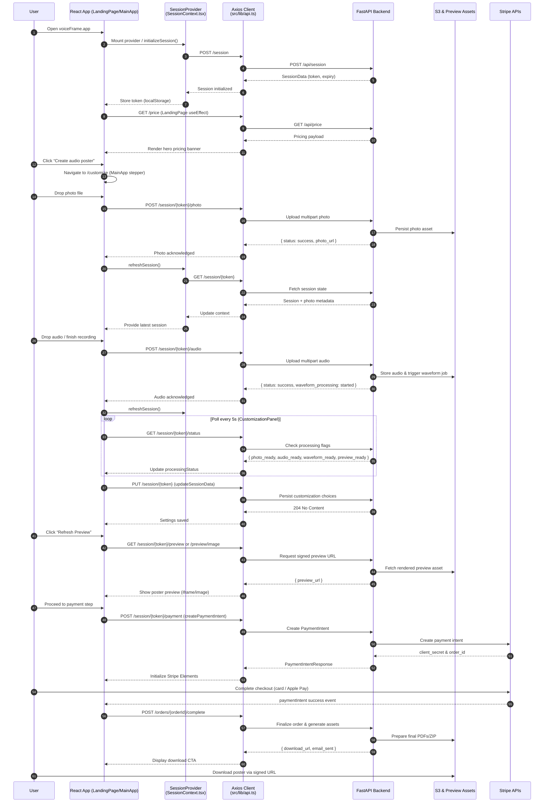

# Frontend Request Lifecycle

```mermaid
sequenceDiagram
    autonumber
    participant U as User
    participant UI as React App (LandingPage/MainApp)
    participant Sess as SessionProvider<br/>(SessionContext.tsx)
    participant API as Axios Client<br/>(src/lib/api.ts)
    participant BE as FastAPI Backend
    participant Storage as S3 & Preview Assets
    participant Stripe as Stripe APIs

    U->>UI: Open voiceFrame.app
    UI->>Sess: Mount provider / initializeSession()
    Sess->>API: POST /session
    API->>BE: POST /api/session
    BE-->>API: SessionData (token, expiry)
    API-->>Sess: Session initialized
    Sess-->>UI: Store token (localStorage)

    UI->>API: GET /price (LandingPage useEffect)
    API->>BE: GET /api/price
    BE-->>API: Pricing payload
    API-->>UI: Render hero pricing banner

    U->>UI: Click “Create audio poster”
    UI->>UI: Navigate to /customize (MainApp stepper)

    U->>UI: Drop photo file
    UI->>API: POST /session/{token}/photo
    API->>BE: Upload multipart photo
    BE->>Storage: Persist photo asset
    BE-->>API: { status: success, photo_url }
    API-->>UI: Photo acknowledged
    UI->>Sess: refreshSession()
    Sess->>API: GET /session/{token}
    API->>BE: Fetch session state
    BE-->>API: Session + photo metadata
    API-->>Sess: Update context
    Sess-->>UI: Provide latest session

    U->>UI: Drop audio / finish recording
    UI->>API: POST /session/{token}/audio
    API->>BE: Upload multipart audio
    BE->>Storage: Store audio & trigger waveform job
    BE-->>API: { status: success, waveform_processing: started }
    API-->>UI: Audio acknowledged
    UI->>Sess: refreshSession()

    loop Poll every 5s (CustomizationPanel)
        UI->>API: GET /session/{token}/status
        API->>BE: Check processing flags
        BE-->>API: { photo_ready, audio_ready, waveform_ready, preview_ready }
        API-->>UI: Update processingStatus
    end

    UI->>API: PUT /session/{token} (updateSessionData)
    API->>BE: Persist customization choices
    BE-->>API: 204 No Content
    API-->>UI: Settings saved

    U->>UI: Click “Refresh Preview”
    UI->>API: GET /session/{token}/preview or /preview/image
    API->>BE: Request signed preview URL
    BE->>Storage: Fetch rendered preview asset
    BE-->>API: { preview_url }
    API-->>UI: Show poster preview (iframe/image)

    U->>UI: Proceed to payment step
    UI->>API: POST /session/{token}/payment (createPaymentIntent)
    API->>BE: Create PaymentIntent
    BE->>Stripe: Create payment intent
    Stripe-->>BE: client_secret & order_id
    BE-->>API: PaymentIntentResponse
    API-->>UI: Initialize Stripe Elements

    U->>Stripe: Complete checkout (card / Apple Pay)
    Stripe-->>UI: paymentIntent success event
    UI->>API: POST /orders/{orderId}/complete
    API->>BE: Finalize order & generate assets
    BE->>Storage: Prepare final PDFs/ZIP
    BE-->>API: { download_url, email_sent }
    API-->>UI: Display download CTA
    U->>Storage: Download poster via signed URL
```
